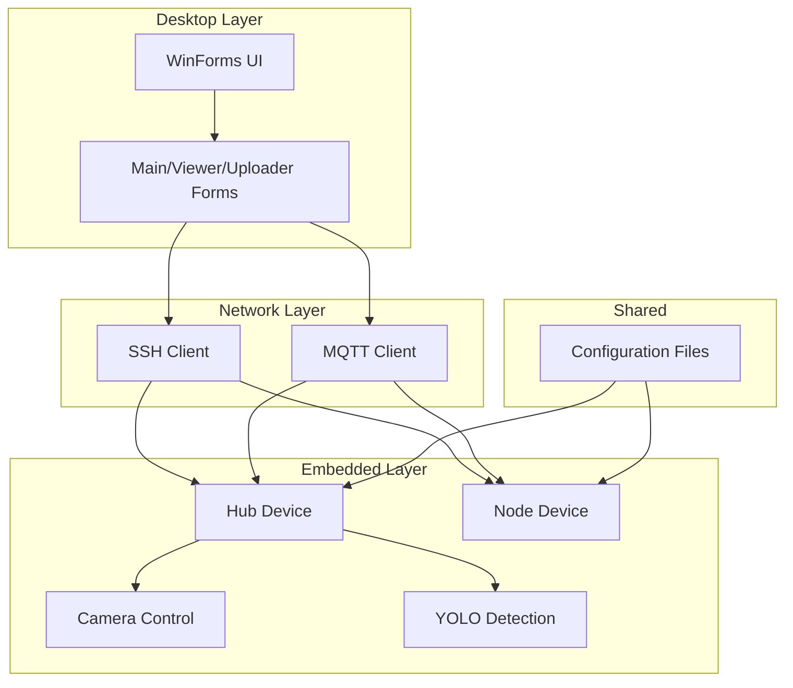
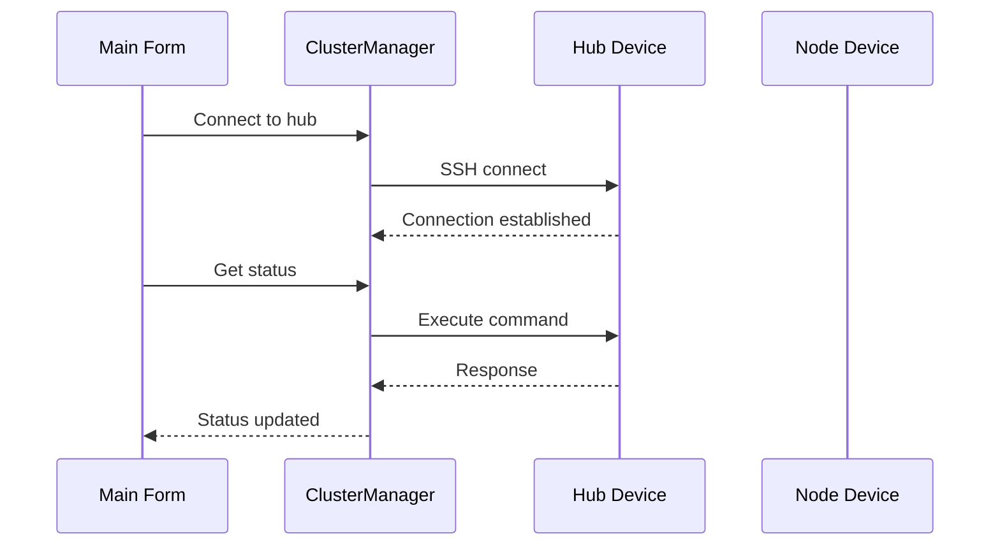

# Dplus Architecture

This document describes the overall architecture of the Dplus system, including both the desktop application and embedded firmware components.

## Repository Overview

The Dplus repository contains two main project folders:

- **Desktop** - C# WinForms application that serves as the management console
- **Embedded** - C++ code that runs on hub and node hardware devices

Both projects share configuration files in `managerSettings.json` but are otherwise independent. The embedded firmware communicates with the desktop app via SSH, and with other cluster members via MQTT.

## Technology Stack

| Component | Technology |
|-----------|------------|
| Desktop Application | .NET 8.0, WinForms |
| Embedded Firmware | MSVC C++ (Windows) |
| Network Communication | SSH.NET, MQTTnet |
| Image Processing | OpenCvSharp4 |
| ONNX Inference | ONNX Runtime (.dll in Desktop) |
| Logging | mLogger library |

## Architectural Overview

The system follows a layered architecture with clear separation between:

1. **Desktop Layer** - User interface and cluster management
2. **Network Layer** - SSH and MQTT communication
3. **Embedded Layer** - Hardware control and image processing
4. **Shared Configuration** - Settings loaded from JSON files



## Desktop Application Architecture

### Main Form (Main.cs)

The main form serves as the application entry point and orchestrates cluster management:

- Initializes the ClusterManager and MqttWorker
- Provides the UI for device management
- Coordinates image uploads and viewing
- Handles configuration loading from `managerSettings.json`

### Viewer Form (Viewer.cs)

The viewer displays images with various overlays:

- Base image rendering with OpenCvSharp
- YOLO detection overlays (bounding boxes, keypoints)
- Charuco board markers
- Custom drawing primitives (points, lines, polygons)
- Orthographic and perspective views

### Uploader Form (Uploader.cs)

Handles image upload functionality:

- Captures images from camera
- Encodes to bytes for transmission
- Uploads via SSH to hub or node devices
- Provides progress feedback

### ClusterManager (Network/ClusterManager.cs)

Manages SSH connections to hub and node devices:

- Maintains persistent SSH sessions
- Executes commands remotely
- Transfers image data
- Handles reconnection on network issues



### MqttWorker (Network/MqttWorker.cs)

Handles MQTT communication with embedded devices:

- Subscribes to cluster topics
- Publishes commands to nodes
- Receives image data and status updates
- Manages MQTT connection lifecycle

## Embedded Firmware Architecture

### Hub Device (hub.cpp)

The hub is the central controller for a camera cluster:

- Manages multiple node devices via SSH
- Runs YOLO detection on captured images
- Publishes processed results to MQTT
- Loads configuration from `managerSettings.json`

```mermaid
flowchart TB
    subgraph Hub Components
        Main[main() loop]
        Mqtt[MqttWorker]
        CM[ClusterManager]
        Camera[CameraCapture]
        Detector[YoloDetector]
    end
    
    Main --> Mqtt
    Main --> CM
    Main --> Camera
    Camera --> Detector
    CM -.-> Mqtt
```

### Node Device (node.cpp)

A node is a camera-enabled endpoint:

- Captures images from its camera
- Publishes raw images to MQTT for processing
- Receives commands from hub via SSH
- Loads per-node settings from configuration

```mermaid
flowchart TB
    subgraph Node Components
        Main[main() loop]
        Mqtt[MqttWorker]
        CM[ClusterManager]
        Camera[CameraCapture]
    end
    
    Main --> Mqtt
    Main --> CM
    Main --> Camera
    Camera -.-> Mqtt
```

## MQTT Messaging

The embedded devices use MQTT for cluster-wide communication. Topics follow a hierarchical naming scheme:

### Hub Topics

- **Publish**: `/hub/{nodeId}/image` - Image data from nodes
- **Subscribe**: `/cluster/hub/{hubId}` - Commands and updates

### Node Topics

- **Publish**: `/hub/{hubId}/image` - Raw images to hub
- **Subscribe**: `/cluster/node/{nodeId}` - Commands and updates

### Message Types

The following messages are used for inter-device communication:

| Type | Description |
|------|-------------|
| `OnImageCommand` | Request image from a node |
| `OnUploadCommand` | Command to upload an image |
| `OnSetExtrinsics` | Update camera extrinsics |
| `OnCapture` | Command to capture an image |

## Configuration Structure

Both desktop and embedded components use JSON configuration files. The structure is hierarchical with sections for different components.

### Desktop Configuration

The desktop app reads from `Desktop/managerSettings.json`:

- **hub**: Hub device configuration (ID, MQTT topic, intrinsics)
- **nodes**: Array of node definitions (ID, IP address)
- **intrinsics**: Camera intrinsic parameters (focal length, principal point)
- **detectors**: YOLO detector profiles (model paths, settings)
- **settings**: Application settings (paths, UI preferences)

### Embedded Configuration

The embedded firmware reads from `Embedded/src/managerSettings.json`:

- **hub**: Hub device configuration
- **node**: Per-node settings for each device
- **detectors**: Detector profiles for pose and object detection

## Key Data Structures

### Device/Node

Represents a cluster member:

```json
{
  "id": 1,
  "ip": "192.168.1.100",
  "mqttTopic": "/cluster/hub/1",
  "intrinsics": {
    "focalLength": 525.0,
    "principalPoint": [320.0, 240.0]
  },
  "active": true
}
```

### CharucoBoardDetectorProfile

Defines a calibration board:

```json
{
  "id": "default",
  "boardType": "chArUco",
  "dictionarySize": 50,
  "markerLength": 25.0,
  "markerDictionaryPath": "models/chArUco-50x25.json"
}
```

### YoloPoseDetectorProfile

Configures pose detection:

```json
{
  "id": "default",
  "modelPath": "models/yolov8n-pose.onnx",
  "inputSize": 640,
  "confidenceThreshold": 0.4,
  "nmsThreshold": 0.5
}
```

## Extension Points

The system provides several extension points for customization:

### Detector Profiles

Add new detector profiles to the configuration to use different ONNX models. The detector system automatically loads and applies them.

### Custom Overlays

The viewer supports custom overlay types by implementing `PrimitiveOverlayLayer`. See `ImageControls.md` in the API documentation for details.

### MQTT Message Handlers

Both desktop and embedded components allow adding custom message handlers via the MqttWorker interface. This enables extending functionality without modifying core code.

## Design Decisions

### SSH for Hub-Node Communication

SSH was chosen over direct TCP/IP for hub-node communication because:

- Provides secure encrypted transport
- Built-in command execution capability
- Easy to implement with SSH.NET
- Allows for future shell-based control if needed

### MQTT for Cluster Communication

MQTT was chosen for cluster-wide communication because:

- Lightweight and efficient for embedded devices
- Publish/subscribe model decouples devices
- Supports QoS levels for reliability
- Works well over unstable networks

### Configuration as JSON

JSON configuration files were chosen because:

- Human-readable and editable
- Easy to parse in both C# and C++
- Supports nested structures well
- Can be validated with JSON schema tools

## Architectural Risks

### Tight Coupling Between Desktop and Embedded

The desktop app relies on SSH access to the embedded devices. Network issues can cause the UI to become unresponsive. Consider implementing better timeout handling and status feedback.

### Configuration Duplication

Both desktop and embedded components have their own configuration files with overlapping sections. This creates maintenance burden if changes are needed in both places.

### Limited Error Reporting

Embedded devices report errors via MQTT messages, which may not always be actionable by the desktop app. Consider improving error categorization and handling.

## Recommendations

1. **Add unit tests** - The repository currently lacks a test suite. Adding tests for critical components (ClusterManager, MqttWorker) would improve reliability.

2. **Document configuration schema** - Create a JSON schema for the configuration files to enable validation and autocompletion in editors.

3. **Improve error handling** - Add more comprehensive logging and error reporting, especially for SSH connection failures.

4. **Consider configuration unification** - Evaluate whether desktop and embedded configuration could be merged into a single source of truth.

5. **Add deployment documentation** - Document the process for deploying embedded firmware to devices, including any flashing procedures.
